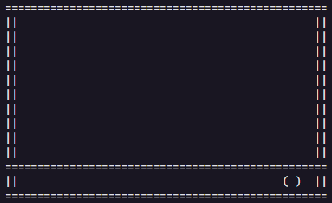
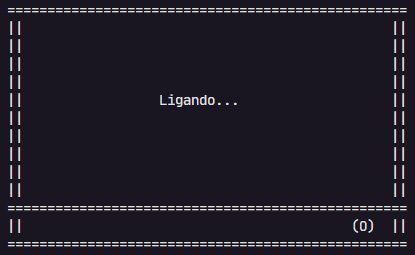

# Smart TV

Exercício realizado na trilha **Backend com Java** do Bootcamp da **DIO** em parceria com o **Santander**.

## Exercício

O exercício consistia na criação de uma classe `SmartTv` com as seguintes propriedades e comportamentos:

- **[Propriedade]** ligada (boolean)
- **[Propriedade]** canal (int)
- **[Propriedade]** volume (int)
- **[Comportamento]** ligar e desligar
- **[Comportamento]** aumentar e diminuir o volume em 1 unidade
- **[Comportamento]** mudar de canal de 1 em 1 ou definindo o número do canal

## Melhorias

Implementei uma forma de "renderizar" no terminal o conteúdo da propriedade que foi alterada.

### Exemplos

- Quadro da TV:
  

- TV ligando:
  
